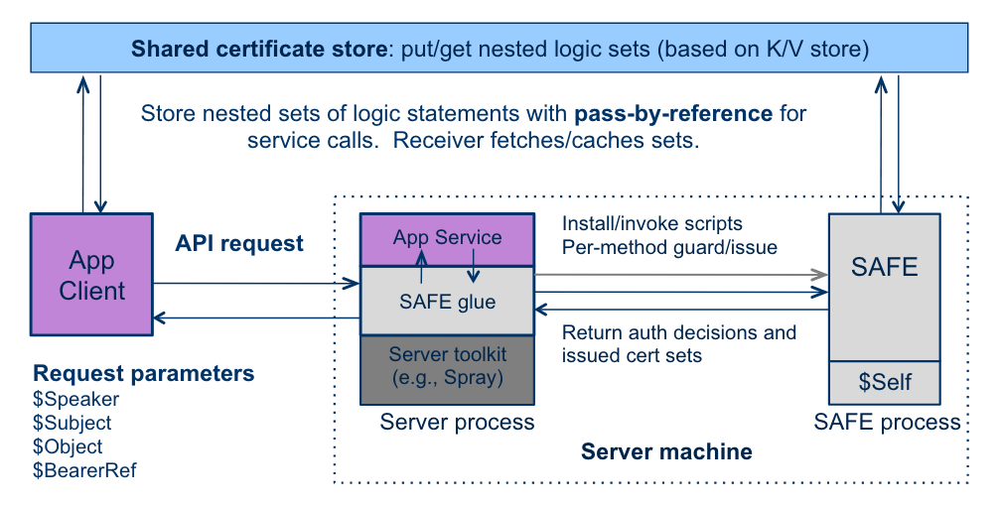

# SAFE Documentation

## Introduction

Secure Access For Everyone (SAFE), is an integrated system for managing trust using a logic-based declarative language. Logical trust systems authorize each request by constructing a proof from a context — a set of authenticated logic statements representing credentials and policies issued by various principals in a networked system.

SAFE implementation is a toolkit for secure and fast authorization in federated environments. SAFE uses  declarative  trust  management. Principals  use  a  declarative  language  to  make
statements about one another and about objects in the system.  These statements are secure assertions: they are authenticated and the source (speaker) of every statement is tracked.  Principals reason from these
statements according to policy rules, which are also written in the declarative language.  Principals run local copies of an inference engine that interprets the language to make trust decisions from local beliefs, local policy rules, and statements (e.g., credentials) received from other participants.

SAFE uses a language called Slang for describing trust policies. SAFE software consists of several components shown in this figure:
- A SAFE inference engine or authorizer built using Scala
- A shared certificate store (sometimes referred to as SafeSets). Multiple implementations are possible, the most widely used is one based on Riak key-value store.
- A resource owner application interested in utilizing SAFE policies to grant access to resources
- A client making a request for a resource



Resource owner application can integrate or remotely invoke a SAFE authorizer process via REST interface to check privileges for accessing elements of the resource. The SAFE authorizer uses a remote shared certificate store to collect and validate assertions made by various principals to construct a proof of the required authorization goal. If a successful proof is constructed, access can be granted by the application or service relying on the authorizer.

SAFE principals are identified by hashes of their public keys. SAFE uses a specialized form of X.509 certificates to encapsulates assertions and policies. SAFE Policies are expressed using a form of Datalog language with an extra 'says:' operator added to the syntax. SAFE offers programming constructs to build
and modify logic sets, link them to form unions, post them to remote shared certificate storage (SafeSets), pass them by reference, and add them to query contexts for trust decisions.  A posted set is accessible to any client that knows its token, but only its issuer can modify it.

### SAFE Certificate format
```
* An exemplary SAFE certificate

‘ATTCPB3CQ0VMax0pFnINQk_NfK7De8EQsGupLFvUzo8'(
    speakerId('r0pUNKMk4YC7I1flIz19zMn3isqPedfD8pI0n6UqYO8’),
    subjectId('r0pUNKMk4YC7I1flIz19zMn3isqPedfD8pI0n6UqYO8’),
    notBefore(’Sun Aug 14 12:24:52 EDT 2016'),
    notAfter('Thu Aug 13 12:39:52 EDT 2017'),
    ’attest_app_kIFJtaA8soeI...ozdUcxJF'{
      link('r0pUNKMk4YC7I1flIz19zMn3isqPedfD8pI0n6UqYO8’) :- spec(“ihost identity set").
      link('q71rr9BYFR-DdtD6wb_EAtX2aUtKrl0Hfz5jdWF-eLM').
      link('kGL0JxbIwn2C8z8--_gYdTYDqWD0WU6YAMOEmQ29Y80').
      runs(qsyPAoGAd8wfPv...FuG7m, kIFJtaA8soeI...ozdUcxJF).
    },
    signature('ucWZE8A…ofS4294brFBk0TpvKw'),
    signatureAlgorithm('SHA256withRSA’)).

```

More information about SAFE:

- [Technical report](https://users.cs.duke.edu/~chase/safe-progress.pdf)
- [GENI authorization policy implementation](https://users.cs.duke.edu/~chase/safe-geni.pdf)

## Additional Documentation

- [SAFE Overview and 'hello world!' example](docs/safe-overview.md)
- SAFE Implementation
  - [SAFE implementation](docs/safe-implementation.md)
  - [Building SAFE](docs/safe-build.md)
  - [Containerized SAFE](docs/safe-docker.md) (SAFE in Docker and Vagrant)
- SAFE Language (Slang)
  - [SAFE Language syntax](docs/safe-slang.md)
  - [Slang shell basics](docs/slang-shell-basics.md)
  - [SAFE primer using Strong policy library](docs/safe-strong-hello-world.md)
  - [SAFE miscellaneous features](docs/safe-misc.md)
  - [SAFE LDAP bridge for gathering group membership assertions from CoManage](docs/safe-comanage.md)
